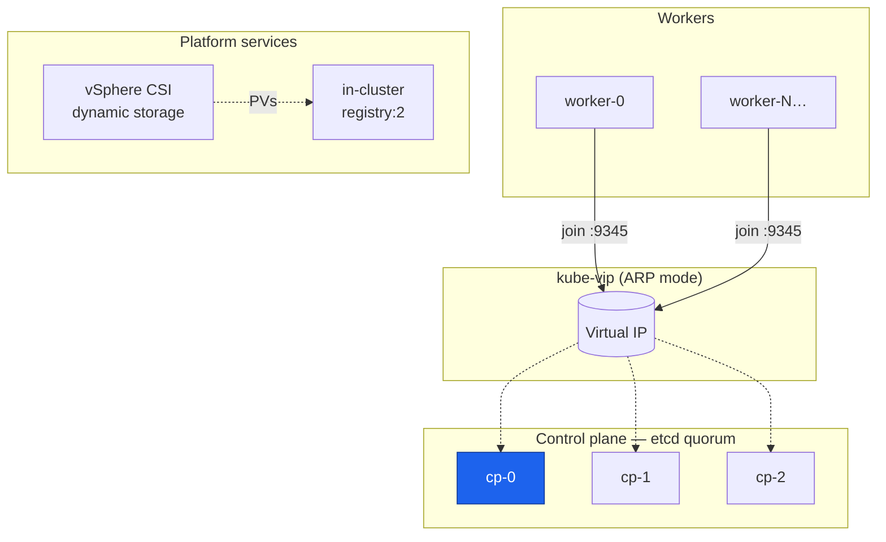

<div align="center">

# ⎈ rke2-vsphere-terraform

**A highly-available RKE2 Kubernetes cluster on VMware vSphere — from bare metal VMs to `kubectl get nodes`, in one `terraform apply`.**

[](https://www.terraform.io/)
[](https://registry.terraform.io/providers/hashicorp/vsphere/latest)
[](https://docs.rke2.io/)
[](docs/rfc/0001-ha-rke2-on-vsphere.md)

</div>

---

No load balancer appliance. No vSphere guest customization specs. No manual vCenter clicking. Point this at an existing vCenter with a cloud-init-enabled VM template, fill in `terraform.tfvars`, and get a real 3-node HA control plane — plus a configurable worker pool, persistent storage, and an in-cluster image registry — entirely through Terraform.

## Why this exists

Most "Kubernetes on vSphere" guides are either a heavyweight platform product you didn't ask for, or a shell script that works once. This is neither: it's `terraform plan`/`apply` — the tool already managing the rest of a typical vSphere estate — doing the whole job, self-documented well enough that changing it later doesn't require re-deriving the bootstrap ordering from scratch.

**→ Read [RFC-001](docs/rfc/0001-ha-rke2-on-vsphere.md) for the full design rationale and alternatives considered.**

## Architecture



**→ See [Architecture & Design](docs/design/architecture.md) for the bootstrap sequence, storage flow, and registry reachability diagrams.**

## Features

| | |
|---|---|
| 🧭 **HA control plane** | 3 control-plane nodes, `kube-vip` ARP-mode VIP, etcd quorum — no external load balancer |
| 🔁 **Fully declarative** | One `terraform apply` provisions VMs, waits for real cluster readiness, then joins the rest — not a race |
| ☁️ **Zero-touch node config** | cloud-init via the VMware GuestInfo datasource — no guest customization specs to manage |
| 💾 **Real persistent storage** | vSphere CSI driver wired in by default — dynamic PVs backed by actual VMDKs, portable across nodes |
| 📦 **In-cluster registry** | A plain `registry:2`, reachable from every node via the control-plane VIP, for custom/mirrored images |
| 📈 **Scales with a variable** | `worker_count` — no forking the config to add capacity |

## Quick start

**Prerequisites** (see [full checklist](CLAUDE.md#prerequisites)):
- A vSphere VM template with cloud-init + the VMware GuestInfo datasource enabled
- The real subnet/gateway for your target portgroup — verified, not guessed
- The target datastore's `ds:///vmfs/volumes/<uuid>/` URL

```bash
git clone https://github.com/pkanderi-abio/vmware-terraform.git
cd vmware-terraform

cp terraform.tfvars.example terraform.tfvars
# edit terraform.tfvars with your vCenter/network/template details

export VSPHERE_USER=administrator@vsphere.local
export VSPHERE_PASSWORD=...
export VSPHERE_SERVER=vcenter.example.com

terraform init
terraform plan
terraform apply
```

```bash
# once apply finishes:
terraform output kubeconfig_fetch_command   # copy/paste to pull a working kubeconfig
kubectl get nodes
```

## Repository layout

```
.
├── main.tf                 # node provisioning, bootstrap gate, CSI/registry installers
├── variables.tf / locals.tf
├── modules/vm/               # role-agnostic vsphere_virtual_machine wrapper
├── templates/
│   ├── cloud-init/            # per-role userdata/metadata
│   ├── manifests/               # kube-vip DaemonSet
│   ├── csi/                      # vSphere CSI secret + StorageClass
│   └── registry/                  # in-cluster registry manifest
└── docs/
    ├── rfc/                        # design decisions & alternatives (RFC-001)
    └── design/                      # architecture deep-dive & diagrams
```

## Documentation

| Doc | What it's for |
|---|---|
| 📄 [RFC-001: HA RKE2 on vSphere](docs/rfc/0001-ha-rke2-on-vsphere.md) | Why this design — motivation, alternatives considered, tradeoffs |
| 📐 [Architecture & Design](docs/design/architecture.md) | How it fits together — sequence diagrams, module structure |
| 🤖 [CLAUDE.md](CLAUDE.md) | Prerequisites checklist, commands, and every hard-won operational gotcha |

## Known limitations

The in-cluster registry has no auth and no TLS — fine on an access-controlled internal network, not fine anywhere else. Cluster resizing beyond `worker_count` requires a plan/apply, not autoscaling. See [RFC-001 → Drawbacks](docs/rfc/0001-ha-rke2-on-vsphere.md#drawbacks--known-limitations) for the complete list.
