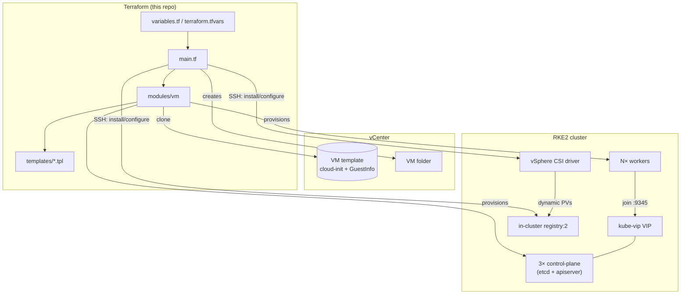
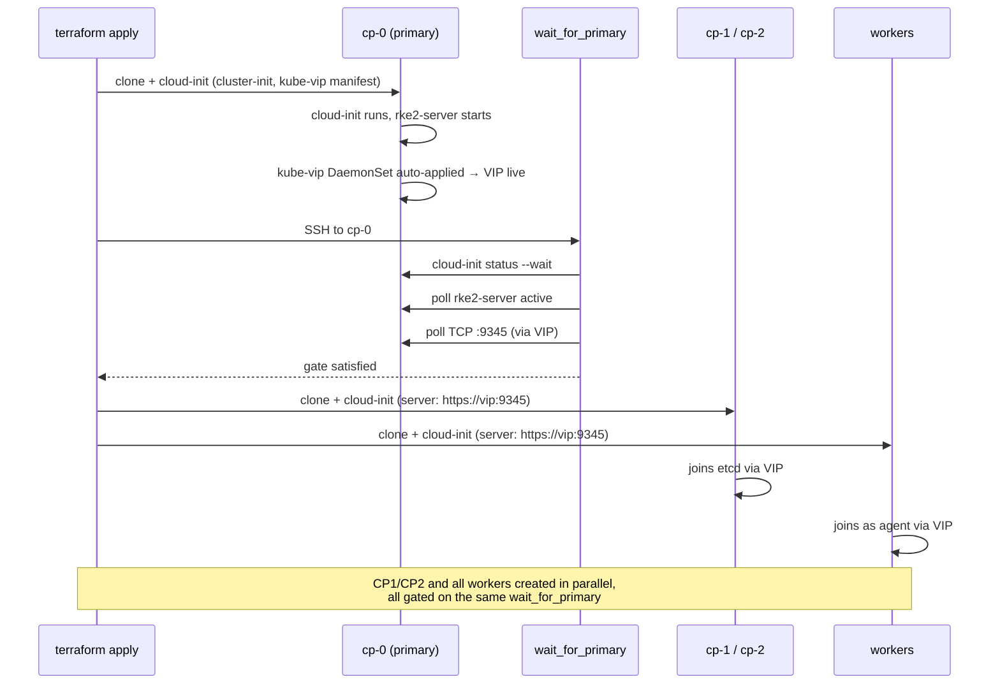
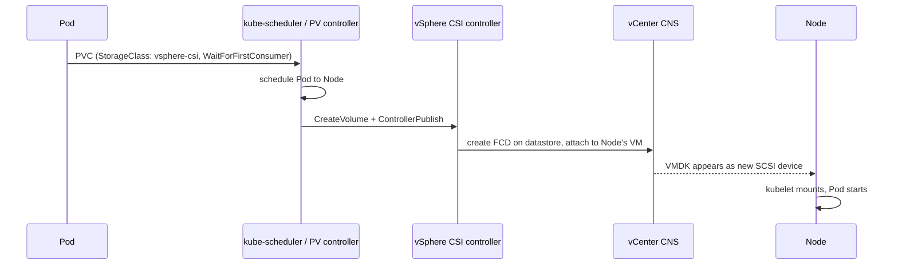
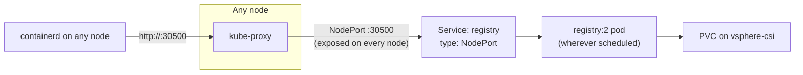

# Architecture & Design

This document is the technical deep-dive companion to [RFC-001](../rfc/0001-ha-rke2-on-vsphere.md). Where the RFC explains *why* each decision was made, this document explains *how* the pieces actually fit together — for anyone modifying the Terraform, not just reading about it.

## Component overview



## Terraform module structure

```
.
├── main.tf              # data sources, node modules, bootstrap gate, day-2 installers
├── locals.tf             # rendered template outputs (manifests, configs)
├── variables.tf          # all inputs, grouped by concern
├── outputs.tf
├── providers.tf
├── versions.tf
├── modules/vm/            # role-agnostic vsphere_virtual_machine wrapper
└── templates/
    ├── cloud-init/        # per-role userdata/metadata .tpl
    ├── manifests/          # kube-vip DaemonSet
    ├── csi/                 # vSphere CSI secret + StorageClass
    ├── registry/            # registry:2 Deployment/Service manifest
    └── registries.yaml.tpl   # containerd mirror config
```

`modules/vm` is deliberately the *only* thing that talks to `vsphere_virtual_machine`. Control-plane and worker nodes differ only in which `templatefile()` output gets passed in as `userdata` — there is no separate "control-plane module" and "worker module."

## Bootstrap sequence



The gate checks raw TCP reachability on the RKE2 supervisor port rather than parsing `/readyz`'s HTTP response — RKE2 disables anonymous auth by default, so an unauthenticated `curl .../readyz` always returns `401`, and a naive `grep -q ok` would loop forever even against a healthy cluster.

## Storage: request → attached volume



Two `modules/vm` settings exist purely to make this path work: `enable_disk_uuid = true` (so the CSI node plugin can match a PV's backing VMDK to the node it's attached to) and `hardware_version = 20` (CNS attach requires vmx-13+; the template shipped at vmx-10). Both apply to every node unconditionally — there's no way to run CSI on only some nodes.

## Registry: reachability model



The registry is reachable at `<control_plane_vip>:<registry_node_port>` from *any* node, regardless of which node the registry pod itself is currently running on or which node currently holds the kube-vip VIP — NodePort is a cluster-wide construct handled by every node's kube-proxy, independent of both. `registries.yaml` (rendered from `templates/registries.yaml.tpl`) is what tells containerd this specific host:port pair is a trusted plain-HTTP endpoint rather than requiring TLS.

## Delivering config to nodes: two distinct mechanisms

This repo uses two genuinely different mechanisms to get configuration onto a node, and conflating them is the single easiest way to break something:

| | Cloud-init (`extra_config`) | Direct SSH push |
|---|---|---|
| **When it runs** | Once per instance, on a genuinely fresh disk | On demand, any time |
| **Used for** | Initial node config: hostname, network, RKE2 install, kube-vip manifest, `registries.yaml` on *new* nodes | Retrofitting config onto nodes that already existed before a template change (e.g. `registries.yaml` on the original 9 nodes) |
| **Terraform resource** | `vsphere_virtual_machine.extra_config` via `modules/vm` | `null_resource` + `provisioner "file"` / `"remote-exec"` |
| **Safe to re-run on an existing node?** | Produces a real reboot that changes nothing — cloud-init skips its per-instance stage entirely once a marker exists on disk | Yes, idempotent by design |

See `CLAUDE.md` → "Known rough edges" for the specific incident this distinction came from (an etcd corruption caused by forcing cloud-init to re-run against a disk that already had cluster state on it).

## Control-plane reconfiguration safety

Any live change to an already-running node (`enable_disk_uuid`, `hardware_version`, `vapp`, the registry mirror push) follows the same rule throughout this codebase: **workers first, then control-plane nodes one at a time, never in parallel.** Restarting `rke2-server` restarts that node's etcd member; restarting all three simultaneously risks a full quorum loss. This is enforced by explicit `depends_on` chains for the three `configure_registry_mirror_cp*` resources, and by convention (rolling `-target` applies) for the VM-hardware-level changes that predate that pattern.

## Where to go next

- **RFC-001** — the decisions and alternatives behind this design.
- **`CLAUDE.md`** — the accumulated list of environment-specific gotchas, several discovered the hard way during the first real deployment (network subnet mismatches, vApp property drift, hardware-version incompatibility, cloud-init's per-instance behavior). Read it before making changes that touch already-running infrastructure.
