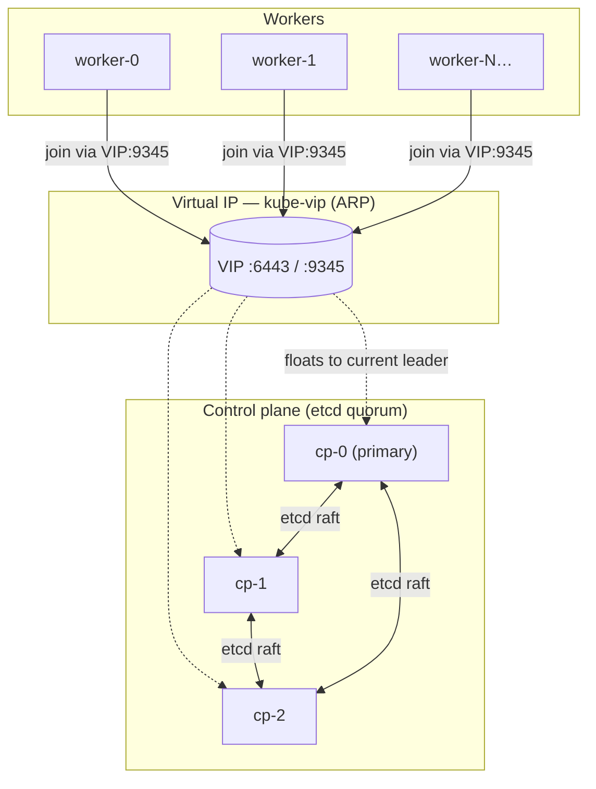

# RFC-001: Highly-Available RKE2 on VMware vSphere

| | |
|---|---|
| **Status** | Accepted — Implemented |
| **Date** | 2026-07-18 |
| **Scope** | `vmware-terraform` root module |

## Summary

Provision a production-shaped, highly-available Kubernetes cluster on an existing VMware vSphere estate using nothing but Terraform and cloud-init — no external load balancer, no manual vCenter clicking, no configuration management layer bolted on afterward. Three RKE2 control-plane nodes behind a `kube-vip` virtual IP, a configurable pool of workers, dynamic block storage via the vSphere CSI driver, and an in-cluster image registry, all created and converged by `terraform apply`.

## Motivation

Most "Kubernetes on vSphere" write-ups fall into one of two camps: a heavyweight platform product (Tanzu, Rancher's own vSphere driver) that assumes you want its whole control plane and licensing model, or a hand-rolled shell-script tutorial that works once and rots the moment vSphere or Kubernetes versions move. Neither fits a small-to-mid vSphere estate that wants:

- A real HA control plane (not a single apiserver with a cron job promising to notice when it dies)
- Ordinary `terraform plan`/`apply` as the only interface — the same tool already used to manage the rest of the vSphere estate
- No dependency on an external load balancer appliance (F5, NSX-ALB, a hand-run HAProxy VM) just to get a stable API server address
- A path to "day 2" capabilities — persistent storage, a private registry — without switching tools

## Goals

- `terraform apply` takes a vCenter with a cloud-init-capable template and produces a `kubectl`-reachable, HA Kubernetes cluster.
- Cluster size (worker count) is a variable, not a fork.
- No external dependency beyond vCenter itself and outbound internet access from the cluster nodes (for RKE2's installer and image pulls).
- The whole thing is re-runnable: `terraform apply` on an already-converged cluster is a no-op.

## Non-Goals

- Multi-vCenter / stretched-cluster topologies.
- Autoscaling worker pools (`worker_count` is a static plan-time value).
- Managing the source VM template's build process (that's a Packer concern, deliberately out of scope — see "Alternatives Considered").
- A general-purpose "Kubernetes on any hypervisor" abstraction. This is vSphere-specific by design.

## Detailed Design

### Topology

Three control-plane nodes (hardcoded — see [Alternatives Considered](#control-plane-count-fixed-at-three)) fronted by a `kube-vip` virtual IP running in ARP mode, plus `N` worker nodes. Node identity — hostname, static IP, RKE2 role — is driven entirely by list index (`control_plane_ip_addresses`, `worker_ip_addresses`), not dynamic discovery.

### Bootstrap ordering is the core problem this RFC solves

RKE2 HA requires the VIP to be live before the second/third control-plane node or any worker can join — but a vSphere `CloneVM` task completing tells you nothing about whether cloud-init, let alone RKE2, has finished inside the guest. The design makes this explicit rather than racing it:

1. **`cp-0`** is cloned with `cluster-init` semantics and carries the `kube-vip` DaemonSet manifest, dropped into RKE2's auto-apply manifests directory.
2. **A synchronization gate** (`null_resource.wait_for_primary`) SSHes into `cp-0` and blocks on `cloud-init status --wait`, then `rke2-server` being active, then raw TCP reachability on the VIP's join port. Only once all three are true does Terraform consider "the cluster" to exist.
3. **`cp-1`, `cp-2`, and every worker** `depends_on` that gate, and join via `https://<vip>:9345`.

### Node provisioning: cloud-init over vSphere customization specs

Every node is a clone of one pre-built template, differentiated entirely by rendered cloud-init `userdata`/`metadata` injected via `extra_config["guestinfo.userdata"]` (the VMware GuestInfo datasource) — not vSphere's native guest customization spec mechanism. GuestInfo is simpler to reason about from Terraform (plain string templating, no vCenter-side customization spec objects to manage), and it's what modern cloud images already ship a datasource for.

### Cluster join secret: pre-shared, not auto-generated

RKE2 normally generates its own join token on the first server and expects other nodes to read it. That requires a remote-exec round trip (SSH to `cp-0`, read the token, feed it to the next node's cloud-init) before any other node's config can even be rendered — an ordering dependency the whole design otherwise avoids. Instead, the operator picks the token (`openssl rand -hex 32`) and it flows into every node's rendered config identically, in parallel, at plan time.

### Storage: vSphere CSI, not a local-disk provisioner

RKE2 ships no default `StorageClass`. The obvious lightweight choice — Rancher's own `local-path-provisioner` — pins a PV to whichever node created it, which is a poor fit for a cluster whose entire premise is HA workloads that should be able to reschedule. The vSphere CSI driver gives real, network-attached VMDKs on the vSphere datastore instead, at the cost of two VM-level prerequisites (`enable_disk_uuid`, a hardware version ≥ vmx-13) that this module now sets unconditionally on every node.

### In-cluster registry, not an external Harbor

A `registry:2` Deployment on the cluster's own CSI storage, exposed via `NodePort` on the control-plane VIP, gets nodes a place to pull custom/mirrored images from without provisioning a separate VM or standing up Harbor's considerably heavier stack. It has no auth and no TLS by design — see [Drawbacks](#drawbacks--known-limitations).

## Alternatives Considered

### RKE2 vs. kubeadm vs. k3s
kubeadm is the "do it yourself" upstream tool — it would have meant reimplementing certificate rotation, etcd snapshotting, and CIS hardening by hand. k3s is excellent but optimizes for edge/single-node profiles (SQLite backend by default, different HA story). RKE2 already assumes an HA, hardened, etcd-backed profile and ships a `kube-vip`-friendly bootstrap path — it's the shape this problem actually has.

### `kube-vip` vs. an external load balancer
An F5/NSX-ALB/HAProxy VM is one more thing to provision, patch, and fail over — and this design's whole premise is "no external dependency beyond vCenter." `kube-vip` in ARP mode runs as a cluster workload and needs nothing but a free IP on the same L2 segment.

### Control-plane count fixed at three
Five nodes tolerate one more failure but cost two more VMs for a marginal home-lab/small-estate benefit; one node isn't HA at all. Three is enforced by a `variable` validation block rather than left as an accidental convention, so a future two- or four-node attempt fails at `plan` time with an explicit reason instead of producing a half-working cluster.

### vSphere guest customization specs vs. cloud-init/GuestInfo
Customization specs are natively "vSphere," but they're also stateful vCenter objects Terraform would need to manage as a second config surface, and they don't compose well with `templatefile()`-driven per-node rendering. GuestInfo is just string injection into `extra_config` — one mechanism, fully expressed in `.tf` and `.tpl` files.

### Building the source template in this repo
Rejected on scope grounds: template creation (Packer, or an OVA import pipeline) is a fundamentally different lifecycle — built rarely, versioned separately — from cluster instantiation, which happens on every `apply`. Coupling them would mean every cluster change risks rebuilding a golden image. `var.template_name` is intentionally a pointer to something built elsewhere.

### Harbor vs. plain `registry:2`
Harbor brings RBAC, vulnerability scanning, and a UI — real value, and a real operational surface (its own database, its own upgrade cadence) that wasn't justified for "give nodes somewhere to pull a custom image from." Plain `registry:2` is a single stateless-except-for-its-volume container; the tradeoff is documented explicitly rather than silently assumed (see Drawbacks).

## Drawbacks / Known Limitations

- **The in-cluster registry has basic auth but still no TLS.** It is reachable by anything that can route to the control-plane VIP, and credentials go over plaintext HTTP. Acceptable only because that network is itself access-controlled; this does not belong on a network anyone untrusted can reach.
- **Datastore-level storage reliability is an open, active concern**, discovered after production use rather than designed around: a sweep of worker node kernel logs found widespread ext4 journal corruption (hundreds to 1000+ abort events on 5 of 6 nodes) affecting multiple unrelated CSI-backed workloads, independent of any single Terraform operation. This sits below anything this Terraform config controls — see `CLAUDE.md`'s "Known active issue" section — but it means the CSI storage story this RFC otherwise recommends (see "vSphere CSI vs. plain local-disk provisioner" above) is currently undermined by the underlying datastore, not by the design choice itself.
- **Bootstrap ordering depends on SSH reachability** from wherever `terraform apply` runs to the cluster's subnet, and a matching key pair. There is no fallback path if that route is blocked — `terraform apply` simply hangs at `wait_for_primary` until its connection timeout.
- **Cloud-init only processes `write_files`/`runcmd` once per instance.** Any template change made after nodes already exist cannot reach them by rebooting the VM — see `CLAUDE.md`'s "Known rough edges" for the mechanism and the SSH-push workaround this repo uses for the registry mirror config specifically.
- **Reconfiguring a running node's VM hardware (`enable_disk_uuid`, `hardware_version`, `vapp`) has undocumented-by-VMware side effects** (observed: `num_cores_per_socket` and `tools_upgrade_policy` silently reset). Every such change needs a second `terraform plan` to catch what the first apply didn't predict.

## Open Questions

- Should worker pools eventually become their own `for_each`-able "pool" abstraction (mixed sizing/labels), rather than one flat `worker_count`?
- Is there a clean way to make the SSH-based bootstrap gate optional in favor of a fully agent-based join (removing the "Terraform apply host needs SSH to the cluster subnet" constraint)?
- At what registry usage point does the auth/TLS tradeoff need revisiting?
